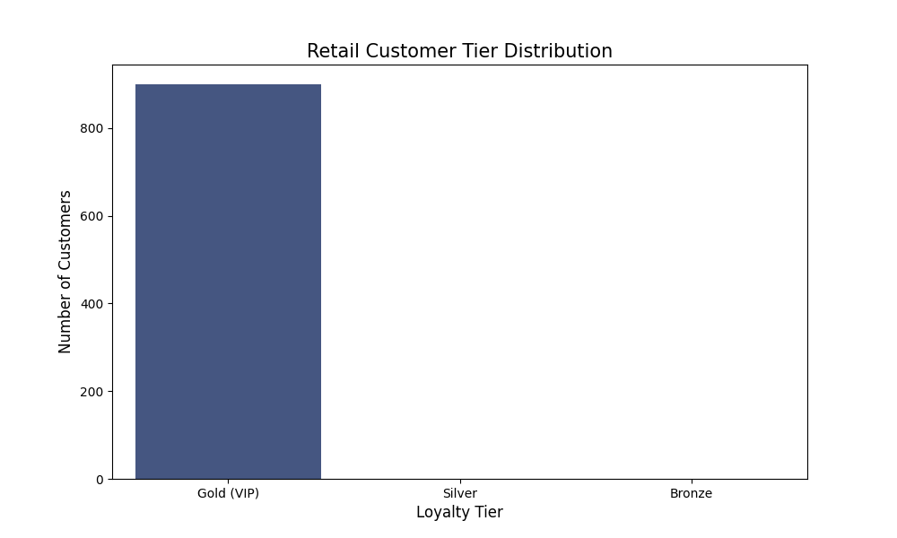

# 🛒 Retail Customer Intelligence Pipeline (FNB Growth Simulation)

An automated ETL (Extract, Transform, Load) pipeline that transforms 50,000 raw retail transactions into a strategic customer loyalty report. This project demonstrates how a bank or retailer can identify their most valuable customers while remaining POPIA compliant.

## 🚀 The Business Problem
How does a business like FNB differentiate between casual shoppers and high-value "VIP" clients? This project solves that by analyzing total lifetime spend and categorizing users into actionable marketing tiers (Gold, Silver, Bronze).

## 🛠️ Technical Workflow (Medallion Architecture)

### 1. Data Generation (Bronze)
- **File:** `generate_data.py`
- **Action:** Engineered a synthetic dataset of 50k records with varied product pricing (Laptops, Smartphones, etc.) and intentional "human errors" (missing email fields).

### 2. ETL & Anonymization (Silver)
- **File:** `analyze_customers.py`
- **POPIA Compliance:** Implemented **SHA-256 Hashing** to mask customer emails. This ensures we can track spending habits without storing sensitive personal identifiers.
- **Data Integrity:** Automatically identified and removed ~2,500 incomplete records.

### 3. Business Intelligence & Segmentation (Gold)
- **File:** `analyze_customers.py`
- **Aggregation:** Used Pandas `groupby` to calculate the total lifetime revenue per customer.
- **Tiering Logic:** - **Gold (VIP):** Spend > R450,000
  - **Silver:** Spend > R300,000
  - **Bronze:** Spend < R300,000

### 4. Visualization
- **File:** `visualize_customers.py`
- **Output:** Generated a professional bar chart (`customer_segments_report.png`) using Seaborn and Matplotlib to show the health of the loyalty program.

## 📈 Key Insights & Results
- **Data Sanitization:** Successfully cleaned the raw dataset of missing values.
- **Privacy First:** Data is ready for third-party marketing analysis with zero risk of identity leakage.
- **Parameter Calibration:** Initial tests showed skewed data; thresholds were recalibrated based on a distribution analysis to ensure a meaningful mix of segments.

## 📂 Project Structure
| File | Description |
| :--- | :--- |
| `generate_data.py` | Creates the initial messy dataset. |
| `analyze_customers.py` | The main engine for cleaning, hashing, and tiering. |
| `visualize_customers.py` | Creates the final analytical dashboard. |
| `customer_segments.csv` | The final structured output for business use. |

## ⚙️ How to Run
1. Clone the repository.
2. Run `python generate_data.py`.
3. Run `python analyze_customers.py`.
4. Run `python visualize_customers.py`.